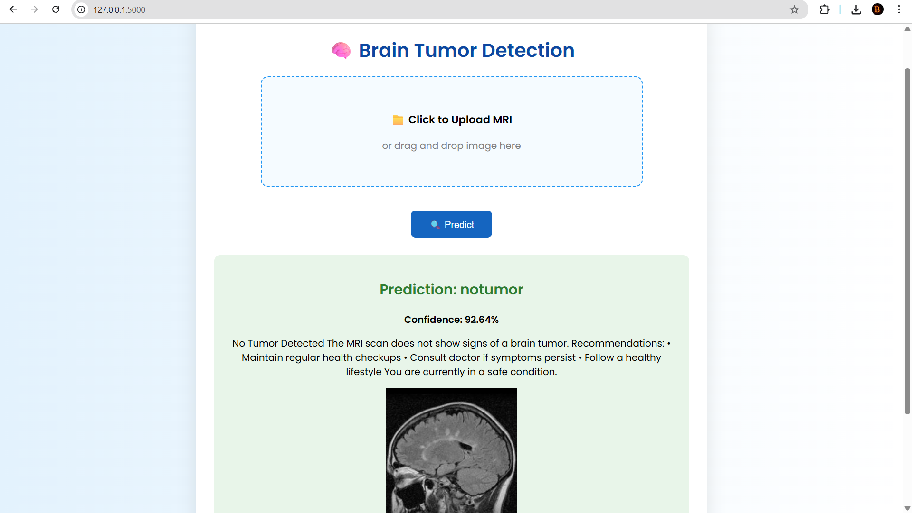
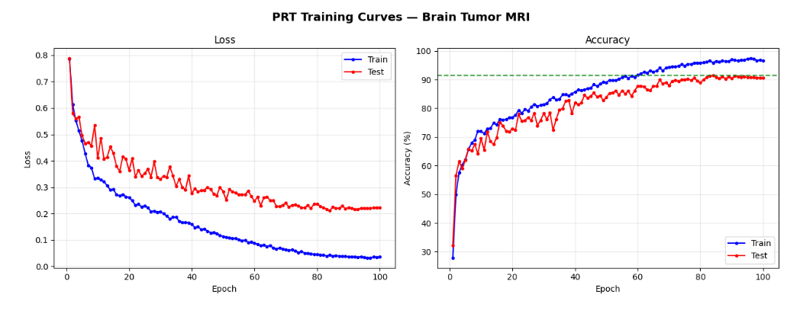
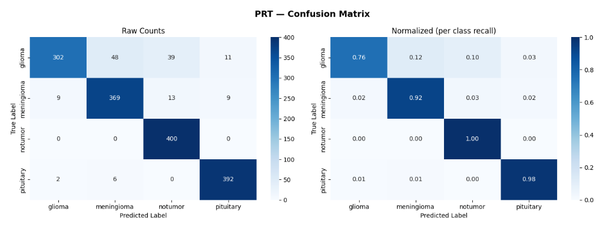
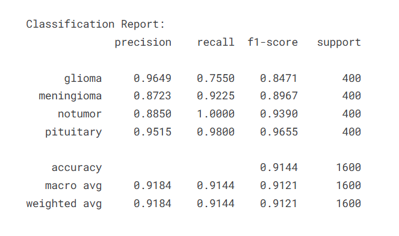

# 🧠 Patch Range Transformer (PRT) — Brain Tumor MRI Classification & Web App

> A novel Vision Transformer architecture + deployed medical web application for real-time brain tumor detection.

---

## 🌐 System Overview



👉 Users can:

* Upload MRI image (drag & drop)
* Get instant prediction
* View confidence score
* Receive medical guidance

---

## 🎯 Problem

Brain tumor diagnosis from MRI scans is:

* Time-consuming
* Requires expert radiologists
* Prone to delay in early detection

---

## 💡 Solution

We built an **end-to-end AI system**:

* 🧠 Custom Deep Learning Model (PRT)
* 🌐 Web Application (Flask)
* 📊 Real-time Prediction + Medical Feedback

---

## 🚀 Key Features

* ✅ Novel Transformer Architecture (PRT)
* ✅ 92.44% Test Accuracy
* ✅ Real-time MRI classification
* ✅ Drag & Drop Web Interface
* ✅ Confidence score output
* ✅ Medical guidance for each prediction
* ✅ Fully deployed Flask app

---

## 🧠 Model — Patch Range Transformer (PRT)

### 🔥 Innovation

| Model          | Attention                                         |
| -------------- | ------------------------------------------------- |
| ViT            | Global attention (O(N²))                          |
| Swin           | Local window attention                            |
| **PRT (Ours)** | **Local attention (radius R) + Global CLS token** |

---

### ⚙️ Mechanism

* Patch tokens → Attend only to neighbors within radius R
* CLS token → Attends globally to all patches
* Final output → CLS + Mean pooled patch features

---

## 📊 Results

| Metric        | Value        |
| ------------- | ------------ |
| Test Accuracy | **92.44%**   |
| Parameters    | 14.6M        |
| Dataset Size  | 7,200 images |
| Classes       | 4            |
| Epochs        | 100          |

---

## 📈 Performance Visualizations

### 🔹 Training Curves



### 🔹 Confusion Matrix



### 🔹 Classification Report



---

## 🏥 Medical Intelligence Layer

The system provides **clinical-style feedback**:

* **Glioma** → High-risk tumor, requires urgent consultation
* **Meningioma** → Usually benign but needs monitoring
* **Pituitary** → May affect hormones, needs evaluation
* **No Tumor** → Healthy condition detected

---

## 🖥️ Web Application

### Features:

* Upload MRI image
* Instant prediction
* Confidence score
* Medical recommendation
* Clean medical UI

---

## ⚙️ Tech Stack

* **Model**: PyTorch, einops
* **Backend**: Flask
* **Frontend**: HTML, CSS, JavaScript
* **Visualization**: Matplotlib, Seaborn
* **Training**: Kaggle (Tesla P100 GPU)

---

## 📁 Project Structure

```
brain-tumor-app/
├── app.py
├── model.py
├── model_architecture.py
├── classes.json
├── prt_model.pth
├── templates/
│   └── index.html
├── static/
│   └── uploads/
├── UI.png
└── README.md
```

---

## ▶️ Run Locally

```bash
git clone https://github.com/your-username/PRT-Brain-Tumor-MRI.git
cd PRT-Brain-Tumor-MRI

pip install -r requirements.txt
python app.py
```

👉 Open in browser:
http://127.0.0.1:5000

---

## 📦 Requirements

```
torch
torchvision
flask
pillow
einops
```

---

## 🔬 Dataset

Brain Tumor MRI Dataset (Kaggle)
Classes:

* Glioma
* Meningioma
* Pituitary
* No Tumor

---

## 🧠 Key Learnings

* Spatially constrained attention improves efficiency
* CLS + patch fusion improves performance
* Preprocessing consistency is critical for inference
* Deployment makes ML models usable in real-world

---

## 🏆 Project Highlights

* Designed a **novel transformer architecture (PRT)** from scratch
* Achieved **92.44% accuracy**
* Built a **full-stack AI system**
* Enabled **real-time medical prediction**
* Created a **user-friendly healthcare interface**

---

## ⚠️ Disclaimer

This project is for **educational and research purposes only**.
Not intended for real medical diagnosis.

---

## 👨‍💻 Author

**Bala Murugan**
AI / Machine Learning Engineer

🔗 https://github.com/Balamurugan245

---

⭐ If you found this project useful, consider giving it a star!
